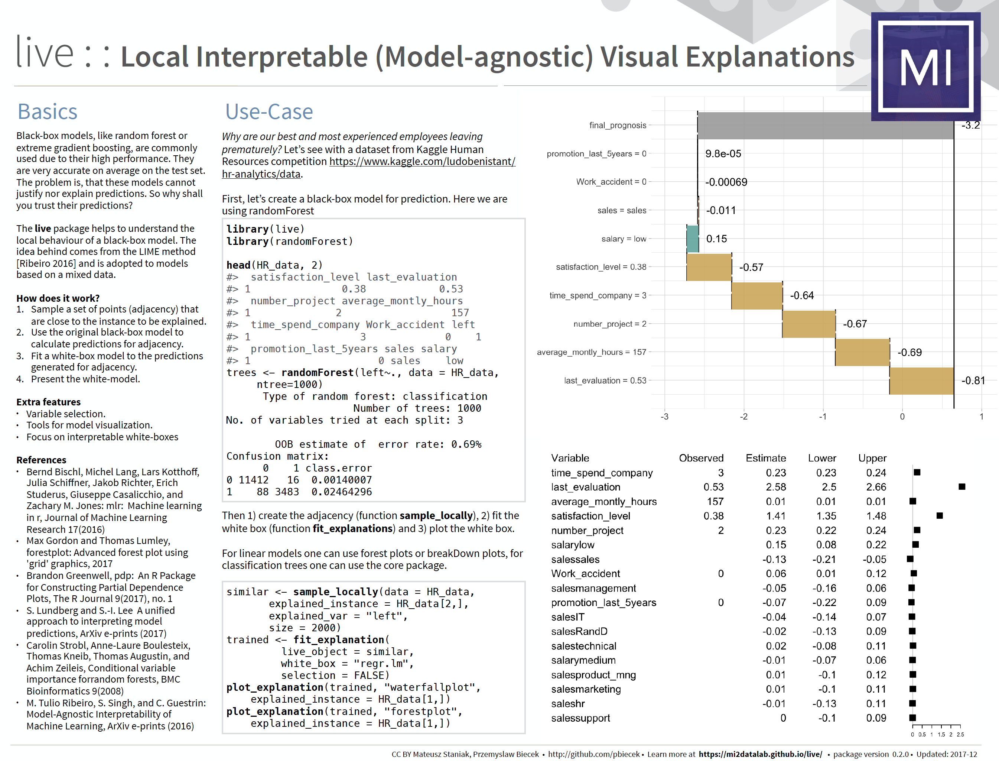

# Justifications for model predictions

Explainers presented in this chapter are designed to better understand the local structure of a black box in a single point. Example applications:

* explanations for predictions. Can be used to validate if a specific prediction is not accidental, is it based on variables important in the domain.
* examination of curvature around a specific point (single observation). Can be used to determine the strength of influence onto a final model. Is it an outlier?

There are more interesting applications. Find out some of them in the *Why Should I Trust You?* article [@lime].


## Basics

Most ML algorithms do not learn from mistakes. 
One calculates predictions and there is no room for improvement.

But! The local predictions can change that! Understanding what causes wrong decisions may lead to model improvements.
After all, if our prediction is wrong we shall update the model.


## Local Interpretable (Model-agnostic) Visual Explanations 



The **live** package (see [@live]) may be seen as an extension of the lime method (see [@lime]). It is based on **mlr** general framework for training of machine learning models (see more [@mlr]).

Let's see an example. We will use the `HR_rf_model` trained with the **randomForest** package on Human Resources Analytics data.

Around a selected point we will fit a linear model.

```{r live_train}
library("live")
library("randomForest")
library("breakDown")

HR_data$left <- as.numeric(as.character(HR_data$left))

HR_rf_model <- randomForest(left~., data = HR_data,
ntree=100)

similar <- sample_locally(data = HR_data, explained_instance = HR_data[1,], explained_var = "left", size = 2000)
similar <- add_predictions(HR_data, similar, HR_rf_model)
trained <- fit_explanation( live_object = similar, white_box = "regr.lm", selection = FALSE)
```

Fitted model may be plotted with *waterfall plot* ...

```{r live_water}
plot_explanation(trained, "waterfallplot", explained_instance = HR_data[1,])
```

... or *forest plot* ...

```{r live_forest}
plot_explanation(trained, "forestplot", explained_instance = HR_data[1,])
```

For more details consult the following vignette.


## breakDown


The `breakDown` package [@breakDown] explains components of model prediction for a single observation. Right now it's working for `lm` and `glm` models. Break Down Plots are inspired by waterfall plots as in [`xgboostExplainer` package](https://github.com/AppliedDataSciencePartners/xgboostExplainer). 

Break Down Plots show the contribution of every variable present in the model. 

Let's see a use case for the `wine` dataset. 

The problem that we are going to solve is to create a model that predicts wine quality and then use the model and explain it’s prediction for a single wine.

We start with a linear Gaussian model for `quality` with three dependent variables `citric.acid`, `sulphates`, `alcohol`.

```{r}
model <- lm(quality ~ citric.acid +  sulphates + alcohol,
               data = wine)
model$coefficients
```

There are just four model coefficients, so it's easy to write down the formula for model predictions. 

$$
\hat y = 2.2847360  + 0.1480342 *  citric.acid + 0.4660404    * sulphates + 0.3153252 * alcohol
$$

But is it easy to explain prediction for a single observation?

```{r}
new.wine <- data.frame(citric.acid = 0.35,
                       sulphates = 0.6,
                       alcohol = 12.5)
predict(model, newdata = new.wine)
```

We see, that this wine got higher quality score than the average. But why?

This is where `breakDown` package is useful. It takes parts of predictions and visualize them. These parts are being calculated by the `predict` function with `type = "terms"`.

```{r}
predict(model, newdata = new.wine, type = "terms")
```

Now it's easy to see that impact of the predicted score have  the high `alcohol` level in this particular wine.

Please note, that these values are *NOT* calculated as x*beta.

```{r}
model$coefficients * cbind(intercept = 1, new.wine)
```

This is because, when we think about effect of an `alcohol` we would like to compare this particular wine with *wine with average alcohol concentration* not *wine with zero alcohol*. 

So, since this particular wine is $1.985733$ units of alcohol stronger than an average wine
```{r}
new.wine$alcohol - mean(wine$alcohol)
```
thus the final effect of the `alcohol` on the wine quality will be
```{r}
model$coefficients["alcohol"] * (new.wine$alcohol - mean(wine$alcohol))
```

Same story is true for other variables.

These calculations are easy to do with `breakDown` package.

```{r, fig.height=3}
library("breakDown")
br <- broken(model, new.wine, baseline = "Intercept")
br
plot(br)
```

### Model Comparisons

What if we have two or larger number of models?
Not a problem for DALEX!

Let's fit a model with 3 variables.

```{r, fig.height=3}
library("breakDown")
library("DALEX")
new.wine <- data.frame(citric.acid = 0.35,
                       sulphates = 0.6,
                       alcohol = 12.5,
                       pH = 3.36,
                       residual.sugar = 4.8)

wine_lm_model3 <- lm(quality ~ citric.acid +  sulphates + alcohol,
                     data = wine)
wine_lm_explainer3 <- explain(wine_lm_model3, data = wine, label = "model_3v",
                               predict_function = stats::predict)

wine_lm_predict3 <- single_prediction(wine_lm_explainer3, observation = new.wine)
plot(wine_lm_predict3)
```

Let's fit a second model with 4 variables.

```{r, fig.height=3}
wine_lm_model4 <- lm(quality ~ pH + residual.sugar + sulphates + alcohol,
                     data = wine)
wine_lm_explainer4 <- explain(wine_lm_model4, data = wine, label = "model_4v",
                               predict_function = stats::predict)

wine_lm_predict4 <- single_prediction(wine_lm_explainer4, observation = new.wine)
plot(wine_lm_predict4)
```

It's easy to compare these models. Just plot both together side by side.

```{r, fig.height=5}
plot(wine_lm_predict3, wine_lm_predict4)
```

You can do this even for non linear models.

```{r, fig.height=7}
library("randomForest")
wine_rf_model4 <- randomForest(quality ~ pH + residual.sugar + sulphates + alcohol, data = wine)
wine_rf_explainer4 <- explain(wine_rf_model4, data = wine, label = "model_rf")

wine_rf_predict4 <- single_prediction(wine_rf_explainer4, observation = new.wine)
plot(wine_rf_predict4, wine_lm_predict4, wine_lm_predict3)
```

