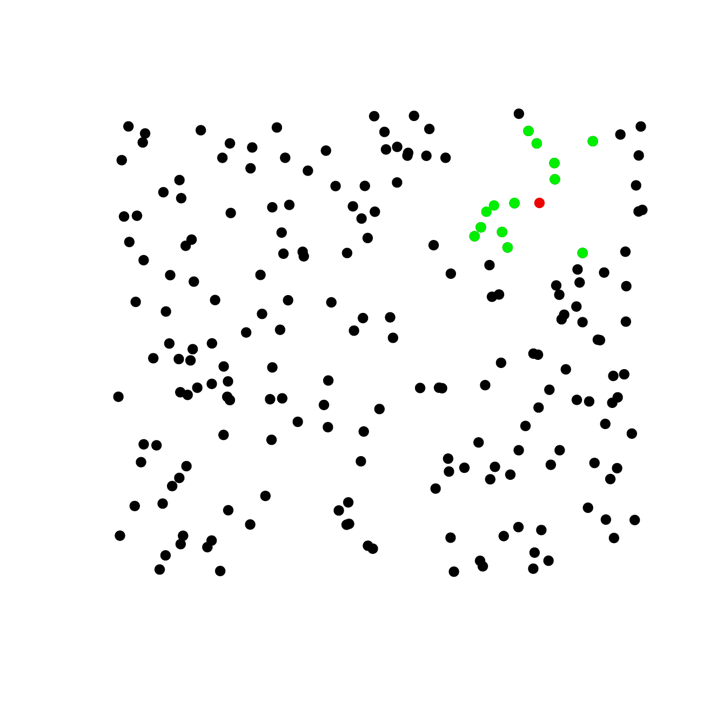

# Ceteris Paribus Profiles {#ceterisParibus}

*NOTE: This chapter is still a work in progress. Expect changes.*

In this chapter we introduce a model agnostic method for model exploration based on the Ceteris Paribus principle ^[Ceteris paribus is a Latin phrase meaning  "other things held constant" or "all else unchanged".]. This universal method helps to understand both local and global structure of a model, helps to compare few models and is useful in diagnostic of model fit.

Some specific versions of this method are in literature under different names, as Partial Dependence Plots [@pdp], Individual Conditional Expectation Plots (ICEPlots) or Accumulated Local Effects Plots [@ALEPlot]. Here we present an uniform yet more extensible approach. We adopt a new name for this approach, namely Ceteris Paribus Profiles, as it better described the idea behind.

This chapter is divided into 5 sections. Each introduces a different aspect of Ceteris Paribus Profiles (CPP).

* Section \@ref(cetParSingleObseSingleModel) introduces Ceteris Paribus profiles for a single observation and a single model. This section introduces basic concepts and notation behind CPP.

* Section \@ref(cetParLocalObseSingleModel) show how to combine set of CP profiles around a single data point in orded to inspect a model locally. This allows to assess model stability, additivness and local fit.

* Section \@ref(cetParGlobalObseSingleModel) show how to combine CP profiles for all observations in order to inspect global features of a model. 

* Section \@ref(cetParGlobalObseMultipleModels) shows how CP profiles can be used for model comparisons on any level. Examples are related to single observation, local and global CP profiles.

* Section \@ref(cetParSingleObseManyModel) shows how different profiles can be aligned on a single plot.


In this chapter we show examples for three predictive models trained on `apartments` dataset from the `DALEX` package. Random Forest model (elastic but biased), Support Vector Machines model (large variance on boundaries) and Linear Model (stable but not very elastic). 
Presented examples are for regression (prediction of square meter price), but the CP profiles may be used in the same way for classification.


```{r, warning=FALSE, message=FALSE}
library("DALEX")
# Linear model trained on apartments data
model_lm <- lm(m2.price ~ construction.year + surface + floor + 
                      no.rooms + district, data = apartments)

library("randomForest")
set.seed(59)
# Random Forest model trained on apartments data
model_rf <- randomForest(m2.price ~ construction.year + surface + floor + 
                      no.rooms + district, data = apartments)

library("e1071")
# Support Vector Machinesr model trained on apartments data
model_svm <- svm(m2.price ~ construction.year + surface + floor + 
                         no.rooms + district, data = apartments)
```

For these models we use `DALEX` explainers created with `explain()` function. There exapliners  wrap models, predict functions and validation data.

```{r, warning=FALSE, message=FALSE}
explainer_lm <- explain(model_lm, 
                       data = apartmentsTest[,2:6], y = apartmentsTest$m2.price)
explainer_rf <- explain(model_rf, 
                       data = apartmentsTest[,2:6], y = apartmentsTest$m2.price)
explainer_svm <- explain(model_svm, 
                       data = apartmentsTest[,2:6], y = apartmentsTest$m2.price)
```

Examples presented in this chapter are generated with the `ceterisParibus` package in version `r installed.packages()["ceterisParibus","Version"]`.

```{r, warning=FALSE, message=FALSE}
library("ceterisParibus")
```


## Ceteris Paribus profiles for a single observation  {#cetParSingleObseSingleModel}

Let $f_{M}(x): \mathcal R^{d} \rightarrow \mathcal R$ denote a predictive model, i.e. function that takes $d$ dimensional vector and calculate numerical score. In section in which we work with larger number of models we use subscript $M$ to index models. But to simplify notation, this subscript is omitted if profiles for only one model are considered. 

Symbol $x \in \mathcal R^d$ refers to a point in the feature space. We use subscript $x_i$ to refer to a different data points and superscript $x^j$ to refer to specific dimensions. Additionally, let $x^{-j}$ denote all coordinates except $j$-th and let $x|^j=z$ denote a data point $x^*$ with all coordinates equal to $x$ except coordinate $j$ equal to value $z$. I.e. $\forall_{i \neq {j}} x^i = x^{*,i}$ and $x^j = z$. In other words $x|^j=z$ denote a $x$ with $j$th coordinate changed to $z$.

Now we can define Ceteris Paribus Profile for model $f$, variable $j$ and point $x$ as

$$
CP^{f, j, x}(z) := f(x|^j = z).
$$
I.e. CP profile is a model response obtained for observations created based on $x$ with $j$ coordinated changes and all other coordinates kept unchanged.

It is convenient to use an alternative name for this plot: What-If Plots. CP profiles show what would happen if only a single variable is changed.

Figure 5.1 shows an example of Ceteris Paribus profile. The black dot stands for prediction for a single observation. Grey line show how the model response would change if in this single observation coordinate `surface` will be changes to selected value. From this profile one may read that the model response is non monotonic. If `construction.year` for this observation would be below 1935 the model response would be higher, but if construction year were between 1935 and 1995 the model response would be lower.


```{r, warning=FALSE, message=FALSE, echo=FALSE, fig.cap = "Ceteris Paribus profiles for a single observation"}
aplevels <- levels(apartments$district)
new_apartment <- data.frame(construction.year = 2000, 
                            surface = 100,
                            floor = 1L,
                            no.rooms = 4,
                            district = factor("Bemowo", levels = aplevels))
profile_rf <- ceteris_paribus(explainer_rf, observations = new_apartment)
plot(profile_rf, selected_variables = "construction.year", 
     size = 0.5, size_points = 3, as.gg = TRUE) +
  xlab("x|surface = ") + ylab("f(x)")
```


#### How to do this in R?

First, we need to specify an observation. Let's assume that we have a new apartment with following attributes.

```{r, warning=FALSE, message=FALSE}
aplevels <- levels(apartments$district)

new_apartment <- data.frame(construction.year = 2000, 
                            surface = 100,
                            floor = 1L,
                            no.rooms = 4,
                            district = factor("Bemowo", levels = aplevels))
new_apartment
```

And we are interested in the predicted price for this apartment calculated with the random forest model `model_rf`.

```{r, warning=FALSE, message=FALSE}
predict(model_rf, new_apartment)
```

We also know, that the variable `construction.year` is used in the model. So how would the model response change for different values of `construction.year` attribute?

Based on this observation we create $N$ virtual apartments with `construction.year` span between 1920 and 2010. New values for this attribute are selected from empirical distribution of the `apartments$construction.year` variable. By default $N = 101$ so percentiles are used for new values of `construction.year`. 

```{r, warning=FALSE, message=FALSE}
profile_rf <- ceteris_paribus(explainer_rf, observations = new_apartment)
profile_rf
```


Also note, that the `apartments` data is available in the model explainer specified as the first parameter of the `ceteris_paribus` function.

These artificial apartments constitute profile of conditional model response for different values of `construction.year`. Such profiles may be plotted with the generic `plot()` function. Note that the `ceteris_paribus()` function by default calculates profiles for every variable in the dataset (this can be changes with the `variables` parameter). 

We use `selected_variables` parameter in the `plot()` function to limit plot to only a single variable `construction.year`.

```{r, warning=FALSE, message=FALSE}
plot(profile_rf, selected_variables = "construction.year")
```


#### Ceteris Paribus for many variables

There is no reason to limit our perspective to only one variable. The `plot()` function by default plots profiles for all numerical variables. 

Use the `selected_variables` parameter to limit number of variables to be presented.

```{r, warning=FALSE, message=FALSE}
plot(profile_rf)
```


## Exploration of local structure with Ceteris Paribus profiles {#cetParLocalObseSingleModel}

Profiles presented in the Section \@ref(cetParSingleObseSingleModel) are also useful for exploration of the local structure of a model. This may be usefull to

```{r, echo=FALSE, fig.cap="Red point stands for the new observation, while green points stand for it's neighbours from validation data.", fig.margin = TRUE}

```

* assess local fitness of a model, 
* assess stability of a model, 
* assess local additivity of a model. 

To assess the local structure of a model we use points from validation data that are close to the point of interest (see Figure 5.2). Close mean here *close in a metric d(x,y)* where the metric may be specified by a user. By default it's Gower's distance implemented in teh `gower` package [@gower]. Gower distance takes into account both quantitative and qualitative variables.

Once neighbors are identified, one can plot profiles for every neighbor. In the Figure 5.3 the blue curve shows Ceteris Paribus profiles for a variable of interest, while all other profiles are for the neighbors.

Profiles are parallel here, what suggests that model is additive in respect to the `surface` variable. Profiles are not far from each other, what suggests that the observation is stable.


```{r, warning=FALSE, message=FALSE, echo=FALSE, fig.cap="Blue point stands for the point of interests. Black points are predictions for the neighbours. The blue curve is the Ceteris Paribus profile for the blue observation. Grey profiles are for neighbours. "}
neighbours <- select_neighbours(apartmentsTest, observation = new_apartment, n = 10)
profile_rf_neig  <- ceteris_paribus(explainer_rf,  observations = neighbours, y = neighbours$m2.price)
plot(profile_rf_neig, 
      selected_variables = "surface") +
  ceteris_paribus_layer(profile_rf, size = 3, alpha = 1, color = "blue1",
                        size_points = 5, color_points = "blue4",
                        selected_variables = "surface") 
```

An interesting extension of such plots is so called `Wangkardu Plot` in which additionally we also present true labels for neighbors. Since neighbors come from validation data, then we may plot also residuals for these predictions.  

In the Figure 5.4 below we highlight residuals with red intervals. Residuals here are relatively small what suggest that around the point of interest the fit is relatively good. 


```{r, warning=FALSE, message=FALSE, echo=FALSE, fig.cap="Blue point stands for the point of interests. Red points are the neighbours. The blue curve is the Ceteris Paribus profile for the blue observation. The red intervals are residuals - differences between the true label and the model response. The grey profiles are Ceteris Paribus profiles for neighbours. "}
neighbours <- select_neighbours(apartmentsTest, observation = new_apartment, n = 10)
profile_rf_neig  <- ceteris_paribus(explainer_rf,  observations = neighbours, y = neighbours$m2.price)
plot(profile_rf_neig, 
      selected_variables = "surface", size_residuals = 2,
      color_residuals = "red", show_residuals = TRUE) +
  ceteris_paribus_layer(profile_rf, size = 3, alpha = 1, color = "blue1",
                        size_points = 5, color_points = "blue4",
                        selected_variables = "surface") 
```


#### How to do this in R?

First, one need to identify neighbors for selected points of interest. This can be done with the `select_neighbours()` function. By default it is using the `gower` distance, but one may change it with the `distance` argument. 

Here we select 10 closes points.

```{r, warning=FALSE, message=FALSE}
neighbours <- select_neighbours(apartmentsTest, observation = new_apartment, n = 10)
head(neighbours)
```

Profiles for neighbors can be calculated with the `ceteris_paribus()` function. We also supply here true labels, they will be useful to calculate residuals

```{r, warning=FALSE, message=FALSE}
profile_rf_neig  <- ceteris_paribus(explainer_rf,  
                                    observations = neighbours, 
                                    y = neighbours$m2.price)
```

One profiles are calculated, one can plot them with the generic `plot()` function.
Here we additionally specify color for residuals, and turn on presentation of residuals, but not the observations.

```{r, warning=FALSE, message=FALSE}
plot(profile_rf_neig, 
      selected_variables = "surface", size_residuals = 2,
      color_residuals = "red", show_residuals = TRUE, show_observations = FALSE) 
```

It is useful to add an additional layer that present the Ceteris Paribus profile for the point of interest.

This profile is highligheted here as a blue curve.

```{r, warning=FALSE, message=FALSE}
plot(profile_rf_neig, 
      selected_variables = "surface", size_residuals = 2,
      color_residuals = "red", show_residuals = TRUE, show_observations = FALSE) +
  ceteris_paribus_layer(profile_rf, size = 3, alpha = 1, color = "blue",
                        selected_variables = "surface") 
```

Merging of profiles is a very useful technique. Below we add a new layer with the average model response foot model predictions. The black line marks the average response from neighbors. 


```{r, warning=FALSE, message=FALSE}
plot(profile_rf_neig, 
      selected_variables = "surface", size_residuals = 2,
      color_residuals = "red", show_residuals = TRUE, show_observations = FALSE) +
  ceteris_paribus_layer(profile_rf, size = 3, alpha = 1, color = "blue",
                        selected_variables = "surface") +
  ceteris_paribus_layer(profile_rf_neig, size = 3, alpha = 1, color = "black",
                        aggregate_profiles = mean, show_observations = FALSE,
                        selected_variables = "surface")
```


## Exploration of global structure with Ceteris Paribus profiles {#cetParGlobalObseSingleModel}

Profiles presented in previous sections are also useful for exploration of the global structure of a model. This may be useful to

* assess the average model response for a selected variable,
* identify interaction between variables,
* assess the variable importance. 


Once neighbors are identified, one can plot profiles for every neighbor. In the Figure 5.3 the blue curve shows Ceteris Paribus profiles for a variable of interest, while all other profiles are for the neighbors.

Profiles are parallel here, what suggests that model is additive in respect to the `surface` variable. Profiles are not far from each other, what suggests that the observation is stable.


```{r, warning=FALSE, message=FALSE, echo=FALSE, fig.cap="a1"}
apartments_sample <- select_sample(apartments, n = 20)
profile_rf_sample  <- ceteris_paribus(explainer_rf, observations = apartments_sample, y = apartments_sample$m2.price)

plot(profile_rf_sample, 
      selected_variables = c("construction.year", "surface"), 
      alpha = 1, color = "black", size = 0.5, size_points = 1,
      show_observations = TRUE) 
```


```{r, warning=FALSE, message=FALSE, echo=FALSE, fig.cap="a1"}
plot(profile_rf_sample, 
      selected_variables = c("construction.year", "surface"), 
      alpha = 1, color = "black", size = 2,
      aggregate_profiles = mean, show_observations = FALSE) +
  ceteris_paribus_layer(profile_rf_sample,
            show_observations = FALSE, size = 0.5,
            selected_variables = c("construction.year", "surface"), 
            show_rugs = TRUE)
```


```{r, warning=FALSE, message=FALSE, echo=FALSE, fig.cap="a1"}
profile_rf_global  <- ceteris_paribus(explainer_rf, observations = apartments, y = apartments$m2.price)

plot(profile_rf_global, 
      alpha = 1,
      selected_variables = c("construction.year", "surface"), 
      aggregate_profiles = mean, show_observations = FALSE) 
```

```{r, warning=FALSE, message=FALSE, echo=FALSE, fig.cap="a1"}
profile_svm_global  <- ceteris_paribus(explainer_svm, observations = apartments_sample, y = apartments_sample$m2.price)
profile_lm_global  <- ceteris_paribus(explainer_lm, observations = apartments_sample, y = apartments_sample$m2.price)

plot(profile_rf_sample, profile_svm_global, profile_lm_global,
      color = "_label_", alpha = 1,
      selected_variables = c("construction.year", "surface"), 
      aggregate_profiles = mean, show_observations = FALSE) 

```


#### How to do this in R?

First, one need to identify neighbors for selected points of interest. This can be done with the `select_neighbours()` function. By default it is using the `gower` distance, but one may change it with the `distance` argument. 

Here we select 10 closes points.


## What-If scenarios: Single Observation and Multiple Models {#cetParSingleObseManyModel}

```{r, warning=FALSE, message=FALSE}
profile_svm <- ceteris_paribus(explainer_svm, observations = new_apartment)
profile_lm  <- ceteris_paribus(explainer_lm, observations = new_apartment)
plot(profile_rf, profile_svm, profile_lm, color = "_label_")
```


## Global Structure and Multiple Models {#cetParGlobalObseMultipleModels}


```{r}
library("DALEX")
library("randomForest")
library("ceterisParibus")
set.seed(59)

model <- randomForest(status ~ gender + age + hours + evaluation + salary, data = HR)

pred1 <- function(m, x)   predict(m, x, type = "prob")[,1]

explainer_rf_fired <- explain(model, data = HR[,1:5], 
                              y = HR$status == "fired", 
                              predict_function = pred1, label = "fired")

cp_rf_fired <- ceteris_paribus(explainer_rf_fired, HR[1:4,])

plot(cp_rf_fired, color = "gender", 
     selected_variables = c("age", "hours", "gender"), 
     alpha = 1, size = 0.5, show_observations = FALSE,  as.gg = TRUE) +
  scale_y_continuous(trans = "probit", breaks = c(0.01,0.02,0.05,0.1,0.5,0.9,0.95,0.98,0.99)) +
  theme(legend.position = "bottom")
```

