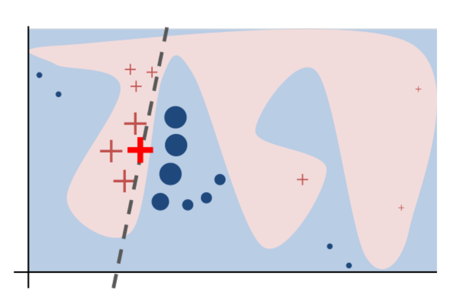

```{r setup, include=FALSE}
knitr::opts_chunk$set(echo = TRUE,
                      warning = FALSE,
                      message = FALSE)
```


Why?
---

  - to increase *trust* in important predictions
  - to *understand* which factors drive the prediction 
  - to inspect unusual/outlier predictions
  - to improve the model

How?
---


# Now details!

# LIME

LIME: general idea
---



LIME: how it's done
---

  - Gaussian sampling for tabular, uniform sampling from interpretable inputs for image/text.
  
  - Scores for new observation are weighted by the distance from original observation.
  
  - Variable selection is usually based on ridge/lasso regression.
  
  - Weights are assigned to interpretable inputs to decide if they _vote_ for or against a given label.

LIME: summary
---

`LIME` approximates the complex model with a simple model and discovers which features in _interpretable representation_ of data drive the prediction.

Pros:

  - intuitive & suitable for different types of data

  - easy to understand & interpret
  
Cons:

  - results can be inconsistent (see: Lundberg)

  - depends on many _hyperparameters_ (kernel, size, ...)
  
# Shapley Values

Shapley values: general idea
---

  - The goal is a decomposition of prediction into sum of scores related to (simplified) features.
  
  - The problem is solved using game theory: _Shapley values_. 
  
  - This approach unifies several methods (including `LIME`).

Shapley values: how it's done
---

  - Different approximate algorithms were proposed.
  
  - Exact methods exist for linear models and tree ensemble methods.
  
  - Classic way: sample permutations of variables, then average contributions.
  
  - Better way: approximation based on LIME and Shapley values for regression. 
  
  
Shapley values: summary
---

`Shapley values` decomposition prediction into feature contributions in a rigorous way rooted in game theory.

Pros:

  - good theoretical properties
  
  - comes with good visual diagnostic tools
  
Cons:

  - won't produce sparse explanations

  - assumes _additivity_, uses simplified inputs 
   (exception: trees)  
    
  - computational issues
 
  
# LIVE

LIVE: general idea
---

  - Modification of `LIME` for tabular data and regression problems.
  - Similar observation for _fake_ dataset are sampled from empirical distributions.
  - Variable selection is possible.
  - Focused on model visualization.

LIVE: how it's done
---

  - All new observations are treated as similar (identity kernel & equal weights)
    (Because of the use of empirical distributions)
  - Variables are selected by LASSO (`glmnet` package).
  - All models from `mlr` are supported both as black box and white box.
  - Model visualization for linear models in particular.

LIVE: summary
---

`live` fits a simple model to approximate the black box locally and allows model visualization for this model.

Pros:

  - flexible & focused on model visualization
  
  - local exploration in data space (no binary inputs)
  
Cons:

  - comes with no theoretical guarantees 
    (though *works* at least in simple cases and is pretty stable)

  - inherits strengts/weaknesses of white box model
  
# breakDown

breakDown: general idea
---


breakDown: how it's done
---

  - Contributions are assigned in a greedy way.
  
  - Waterfall plots are important tool as a visual representation.


breakDown: summary

`breakDown` decompositions the prediction into feature contributions and visualizes them.

Pros:

  - simple computation

  - easy to interpret (in particular compared to SHAP)
  
Cons:

  - limited to additive effects

  - again, no theoretical guarantees
    (though can be thought of as a rough Shapley values estimate)
  
# Let's see some examples!

Dataset
---

```{r data}
library(DALEX)
library(live)
library(lime)
library(shapleyr)
library(mlr)
library(tidyverse)
library(e1071)
load("wine.rda")
glimpse(wine)
wine_svm <- svm(quality ~., data = wine)
nobs <- 5 # wyjasniana obserwacja
```

LIME
---

```{r lime_example}
lime_obj <- lime(wine, wine_svm)
model_type.svm <- function(x, ...) "regression"
lime_expl <- lime::explain(wine[nobs, ], lime_obj, n_features = 11)
plot_features(lime_expl)
```

Shapley values
---

```{r shap_example}
tsk <- makeRegrTask(data = wine, target = "quality")
model <- train("regr.svm", tsk)
shap_expl <- shapley(nobs, model = model, task = tsk)
gather(shap_expl, "variable", "contribution") %>%
  arrange(desc(abs(contribution)))
```

LIVE
---

```{r live_example}
local <- sample_locally(wine, wine[nobs, ], "quality", 500)
local <- live::add_predictions(wine, local, wine_svm)
live_expl <- fit_explanation(local, "regr.lm")
plot_explanation(live_expl, "waterfallplot", wine[nobs, ])
```

LIVE cont.
---
```{r live_forest}
plot_explanation(live_expl, "forestplot")
```

breakDown
---

```{r breakDown_example}
wine_explainer <- DALEX::explain(wine_svm, data = wine, y = "quality")
wine_expl <- single_prediction(wine_explainer, wine[nobs, ])
plot(wine_expl)
```
---


# Time for discussion!
