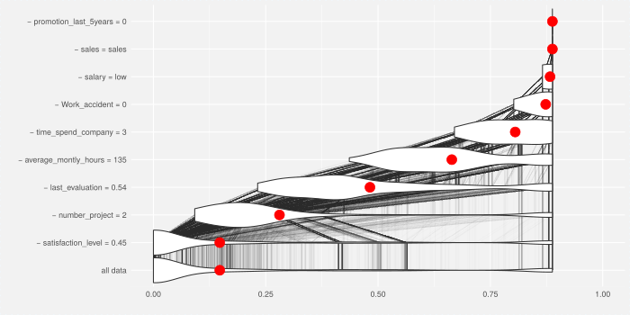

```{r setup, include=FALSE}
knitr::opts_chunk$set(echo = FALSE,
                      warning = FALSE,
                      message = FALSE)
```


Why?
---

  - to increase *trust* in important predictions
  - to *understand* which factors drive the prediction 
  - to inspect unusual/outlier predictions
  - to improve the model

How?
---


# Now details!

# LIME

LIME: general idea
---


LIME: how it's done
---

LIME: summary
---

<!-- one sentence summary -->

Pros:

  - intuitive & suitable for different types of data

  - easy to understand & interpret
  
Cons:

  - results can be inconsistent (see: Lundberg)

  - depends on many _hyperparameters_ (kernel, size, ...)
  
# Shapley Values

Shapley values: general idea
---


Shapley values: how it's done
---

Shapley values: summary
---

<!-- one sentence summary -->

Pros:

  - good theoretical properties
  
  - comes with good visual diagnostic tools
  
Cons:

  - won't produce sparse explanations

  - assumes _additivity_, uses simplified inputs 
   (exception: trees)  
    
  - computational issues
 
  
# LIVE

LIVE: general idea
---

LIVE: how it's done
---

LIVE: summary
---

<!-- one sentence summary -->

Pros:

  - flexible & focused on model visualization

  - pretty stable despite randomness
  
  - local exploration in data space (no binary inputs)
  
Cons:

  - comes with no theoretical guarantees 
    (though *works* at least in simple cases)

  - inherits strengts/weaknesses of white box model
  
# breakDown

breakDown: general idea
---



breakDown: how it's done
---

breakDown: summary

<!-- one sentence summary -->

Pros:

  - simple computation

  - easy to interpret (in particular compared to SHAP)
  
Cons:

  - limited to additive effects

  - again, no theoretical guarantees
    (though can be thought of as a rough Shapley values estimate)
  
# Times for examples!

Dataset
---
```{r data}
library(DALEX)
library(live)
library(lime)
library(shapleyr)
# wstawic dane i pokazac fragment
```

LIME
---

```{r lime_example}
# pokazac wykres
```

Shapley values
---

```{r shap_example}
# pokazac wykres
```

LIVE
---

```{r live_example}
# pokazac dwa wykresy
```

breakDown

```{r breakDown_example}
# pokazac wykres
```
---

