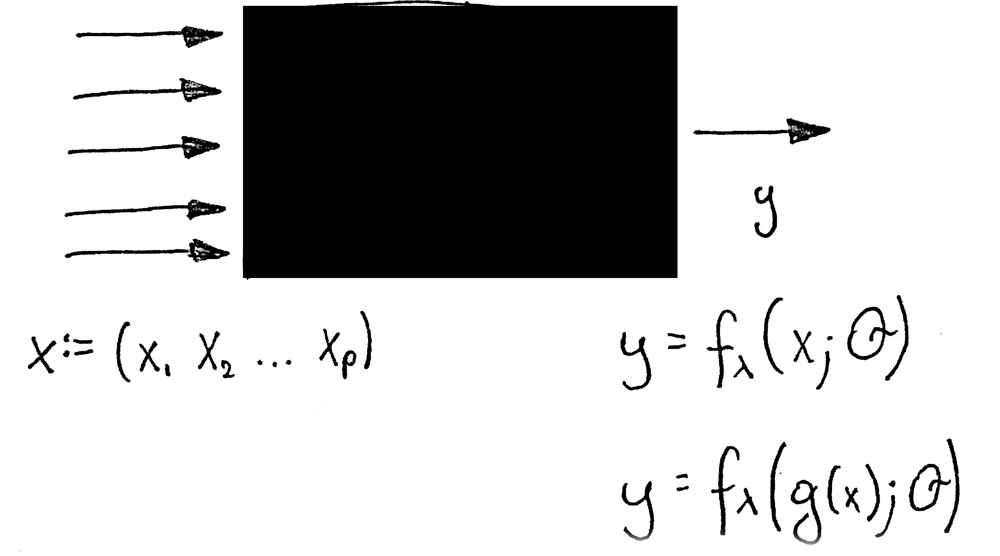

--- 
title: "DALEX: Descriptive mAchine Learning EXplanations"
author: "MI2DataLab"
date: "`r Sys.Date()`"
site: bookdown::bookdown_site
split_by: section+number
output: bookdown::gitbook
documentclass: book
bibliography: [book.bib, packages.bib]
biblio-style: apalike
link-citations: yes
github-repo: rstudio/bookdown-demo
description: "Do not trust a black-box model. Unless it explains itself."
--- 

# Introduction

Machine Learning models are widely used and have various applications in classification or regression tasks. Due to increasing computational power, availability of new data sources and new methods, ML models are more and more complex. Models created with techniques like boosting, bagging of neural networks are true black boxes. It is hard to trace the link between input variables and model outcomes. They are use because of high performance, but lack of interpretability is one of their weakest sides.

In many applications we need to know, understand or prove how input variables are used in the model and what impact do they have on final model prediction.
DALEX is a set of tools that help to understand how complex models are working.

## Notation

This book describes explainers for different machine learning models. Some of these explainers are created by different research groups with different applications in mind.

To keep the notation consistent:

- $x = (x_1, ..., x_p)$ stands for a vector of $p$ variables/predictors. 
- $y$ stands for a vector with target variable. In some applications it will be a continuous variable in others it will be a binary variable.
- $n$ stands for number of observations.
- $f(x, \theta)$ stands for a model. We are considering models that are characterized by a set of parameters $\theta$. In some applications $\theta$ is a low level space of parameters - nice parametric models, in some applications $\theta$ may have a very complex structure.
- $\lambda$ stands for model meta-parameters which are not being directly optimized (like number of trees, max depth, some penalties etc.).
- $g(x)$ stands for a function that pre-process variables. In some applications it may be a standardisation or other pre-processing. 





## Use case - Human Resources Analytics

To ilustrate applications of DALEX to binary classification problems we will use a dataset from Kaggle competition [Human Resources Analytics]( https://www.kaggle.com/ludobenistant/hr-analytics/data). This dataset is avaliable in the **breakDown** package [@breakDown].

```{r eval=FALSE}
library("breakDown")
head(HR_data)
```

```{r hr_data, echo=FALSE}
library("breakDown")
knitr::kable(
  head(HR_data),
  caption = 'HR_data dataset from Kaggle competition Human Resources Analytics'
  )
```

### Logistic regression

In the following chapters to present explainers for logistic regression models we will use `HR_glm_model`.

```{r}
HR_glm_model <- glm(left~., data = HR_data, family = "binomial")
summary(HR_glm_model)
```

Models used in this doccumentation are accessible via **archivist** package. To download the `HR_glm_model` model use the following instruction. 
```
archivist::aread("pbiecek/DALEX/arepo/8fe19a108faf3ddfcabc3de3a0693234")
```

### Random forest

In the following chapters to present explainers for random forest models we will use `HR_fr_model`.

```{r}
library("randomForest")
set.seed(1313)
HR_data$left <- factor(HR_data$left)
HR_rf_model <- randomForest(left~., data = HR_data, ntree = 100)
HR_rf_model
```

Models used in this doccumentation are accessible via **archivist** package. To download the `HR_rf_model` model use the following instruction. 
```
archivist::aread("pbiecek/DALEX/arepo/419d550a92fab6a5f28650130991e2cd")
```


## Use case - Wine quality

To ilustrate applications of DALEX to regression problems we will use a Wine quality dataset from Kaggle competition [UC Irvine Machine Learning Repository](http://mlr.cs.umass.edu/ml/). 

```{r eval=FALSE}
url <- 'https://archive.ics.uci.edu/ml/machine-learning-databases/wine-quality/winequality-white.csv'
wine <- read.table(url, header = TRUE, sep = ";")
head(wine)
```

```{r wineQuality, echo=FALSE}
url <- 'https://archive.ics.uci.edu/ml/machine-learning-databases/wine-quality/winequality-white.csv'
wine <- read.table(url, header = TRUE, sep = ";")
knitr::kable(
  head(wine),
  caption = 'Wine quality dataset from UC Irvine Machine Learning Repository'
  )
```

### Linear regression

In the following chapters to present explainers for gaussian regression models we will use `wine_lm_model`.

```{r}
wine_lm_model <- lm(quality ~ fixed.acidity + volatile.acidity + citric.acid + residual.sugar + chlorides + free.sulfur.dioxide + total.sulfur.dioxide + density + pH + sulphates + alcohol,
               data = wine)
```

Models used in this doccumentation are accessible via **archivist** package. To download the `wine_lm_model` model use the following instruction. 
```
archivist::aread("pbiecek/DALEX/arepo/b99a3d58016e2677221019652cff047f")
```

## Trivia


[The Daleks](https://en.wikipedia.org/wiki/Dalek) are a fictional extraterrestrial race portrayed in the [Doctor Who](https://en.wikipedia.org/wiki/Doctor_Who) BBC series. Rather dim aliens, known to repeat the phrase *Explain!* very often.

```{r include=FALSE}
# automatically create a bib database for R packages
knitr::write_bib(c(
  .packages(), 'bookdown', 'knitr', 'rmarkdown'
), 'packages.bib')
```


